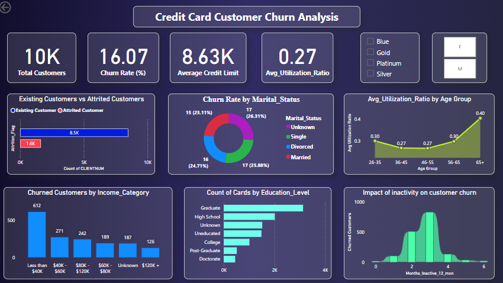

# Credit Card Customer Churn Analysis

This Power BI dashboard project analyzes churn behavior among 10,000+ credit card users using 18 features including credit limit, card category, and usage patterns.

## 📊 Dashboard Features
- Interactive visuals for churn analysis by education, income, card category, and usage
- DAX-calculated KPIs like churn rate, average utilization ratio, and customer segment analysis
- Slicers for better user interaction

## 📌 Tools Used
- Power BI

